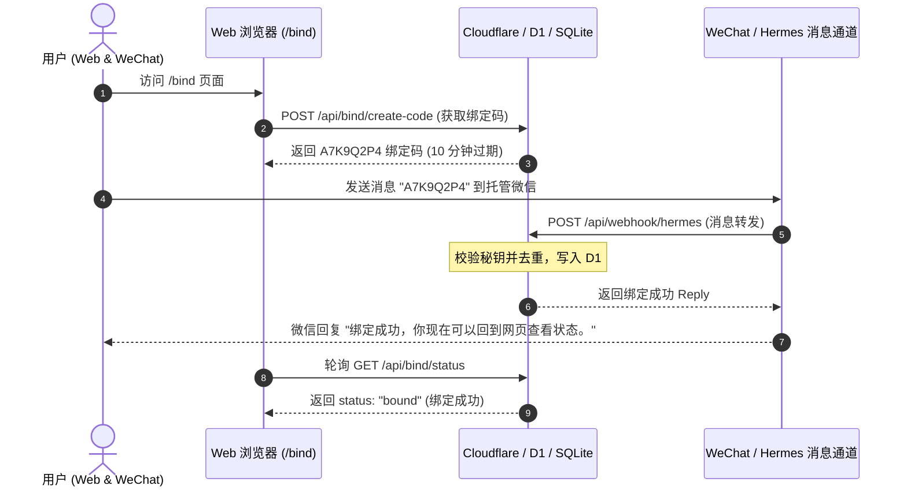

# Hermes 微信绑定流说明规范 (HERMES_BINDING_FLOW)

本规范定义了小王子 SoulMate 项目中微信托管服务 Hermes 与 Cloudflare 之间进行绑定的全套协议契约、防重约束及系统边界。

---

## 1. 业务流程与架构边界



> [!IMPORTANT]
> - **当前处于仿真绑定阶段**：未部署腾讯云 Hermes 服务，未介入真实 iLink / 微信长连接，不实现微信陪伴消息自动生成，不扣减 Token，不改变 BufPay 微信支付逻辑。
> - **AGENT_BACKEND 隔离**：未将 `AGENT_BACKEND` 设置为 `hermes`，继续使用网页端 LocalAgentManager。

---

## 2. API 接口规范与报文设计

### 2.1 生成绑定码 (Web Session)
* **URL**: `POST /api/bind/create-code`
* **状态值**: `pending`
* **说明**：每次请求会强制检查是否已存在 pending code。如果存在，会将其状态置为 `revoked`，再生成新的 8 位不重复大写字母+数字绑定码。
* **响应示例**:
  ```json
  {
    "code": "A7K9Q2P4",
    "expires_at": "2026-06-06T05:50:00.000Z",
    "status": "pending",
    "instructions": "请在小王子微信中发送绑定码 A7K9Q2P4 完成绑定"
  }
  ```

### 2.2 查询绑定状态 (Web Session)
* **URL**: `GET /api/bind/status`
* **响应状态**: `unbound` | `pending` | `bound` | `expired` | `revoked`
* **说明**：如果该用户的 Profile 已经拥有 active bindings 微信绑定，直接返回 `bound` 并在 `masked_external_id` 中返回脱敏后的微信号。
* **响应示例 (已绑定)**:
  ```json
  {
    "status": "bound",
    "expires_at": null,
    "bound_at": "2026-06-06T05:40:00.000Z",
    "channel": "wechat",
    "masked_external_id": "wxid***123"
  }
  ```

### 2.3 Hermes Webhook 接收端
* **URL**: `POST /api/webhook/hermes`
* **鉴权要求**：请求头中必须包含匹配的 `x-hermes-secret`。不接受 Bearer 凭证作为主线流程。
* **主契约报文**:
  ```json
  {
    "type": "message",
    "message_id": "msg_898912781",
    "hermes_user_id": "wxid_abc123",
    "text": "A7K9Q2P4",
    "timestamp": 1780720490000
  }
  ```
* **绑定成功响应**:
  ```json
  {
    "ok": true,
    "action": "bind_success",
    "reply": "绑定成功，你现在可以回到网页查看状态。"
  }
  ```

---

## 3. 并发安全性与幂等性保障

1. **唯一性偏独特索引 (DB 级硬约束)**：
   * `idx_agent_bindings_wechat_external_active`：防范同一微信账号绑定到多个用户 Profile。
   * `idx_agent_bindings_profile_wechat_active`：防范同一用户重复绑定多个微信号。
2. **消息去重设计 (`hermes_messages` 表)**：
   * 所有进入 Webhook 的报文会首先尝试 `INSERT OR IGNORE` 消息 ID。如果受影响行数为 0，认定为重复投递，直接阻断并返回 `action: 'duplicate'`。
3. **绑定码幂等消费**：
   * 已置为 `consumed` / `expired` / `revoked` 的绑定码被再次发送时，Webhook 直接拒绝，不进行绑定修改。

---

## 4. 系统事件与隐私脱敏 (System Events Masking)

为了完全满足合规审计，`system_events` 对所有记录进行严格脱敏：
- **Bind Code**: 仅记录 SHA-256 截断前 16 位及后 2 位遮罩（例：`**P4`），不打印原始明文。
- **Secret**: 绝不写入 system_events。
- **WeChat ID**: 进行中间屏蔽处理（例：`wxid***123`）。
- **Web Session Token**: 绝对禁止作为 Payload 写入。
