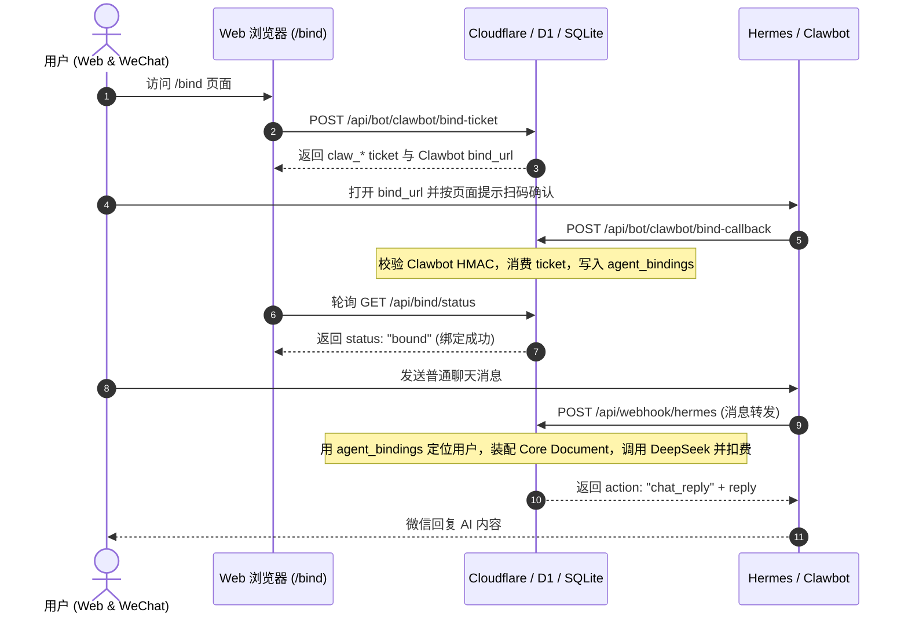

# Hermes / Clawbot 微信绑定流说明规范 (HERMES_BINDING_FLOW)

本规范定义了小王子 SoulMate 项目中 Hermes / Clawbot 与 Cloudflare 之间进行网页扫码绑定和普通聊天的协议契约、防重约束及系统边界。

---

## 1. 业务流程与架构边界



> [!IMPORTANT]
> - **当前目标**：Cloudflare 侧已具备 Clawbot 扫码绑定与绑定后普通聊天闭环；腾讯云 Clawbot bridge 仍需 staging 联调真实微信链路后再灰度开放。
> - **AGENT_BACKEND 隔离**：不需要将 `AGENT_BACKEND` 设置为 `hermes`。Agent Brain、Core Document、DeepSeek 调用与扣费全部由 Cloudflare API 侧处理。
> - **冻结旧路径**：不要通过 OpenClaw adapter，也不要要求用户向微信发送 8 位绑定码完成绑定。绑定动作只走 Clawbot 网页扫码与 `/api/bot/clawbot/bind-callback`。

---

## 2. API 接口规范与报文设计

### 2.1 生成 Clawbot 绑定 ticket (Web Session)
* **URL**: `POST /api/bot/clawbot/bind-ticket`
* **状态值**: `pending`
* **说明**：每次请求会撤销该用户旧的 pending ticket，再生成新的 `claw_*` ticket。ticket 复用 `bind_codes.code` 存储，不新增迁移。
* **响应示例**:
  ```json
  {
    "ticket": "claw_0123456789abcdef0123456789abcdef0123456789abcdef",
    "expires_at": "2026-06-06T05:50:00.000Z",
    "status": "pending",
    "bind_url": "https://wechat.tai.lat/xms/wechat/bind?ticket=claw_0123456789abcdef0123456789abcdef0123456789abcdef",
    "provider": "clawbot"
  }
  ```

### 2.2 查询绑定状态 (Web Session)
* **URL**: `GET /api/bind/status`
* **响应状态**: `unbound` | `pending` | `bound` | `expired` | `revoked`
* **说明**：如果该用户的 Profile 已经拥有 active bindings 微信绑定，直接返回 `bound` 并在 `masked_external_id` 中返回脱敏后的微信号。
* **响应示例 (已绑定)**:
  ```json
  {
    "status": "bound",
    "is_bound": true,
    "expires_at": null,
    "bound_at": "2026-06-06T05:40:00.000Z",
    "channel": "wechat",
    "masked_external_id": "wxid***123"
  }
  ```

### 2.3 Clawbot 绑定 callback
* **URL**: `POST /api/bot/clawbot/bind-callback`
* **鉴权要求**：请求头必须包含 `x-clawbot-timestamp`、`x-clawbot-nonce`、`x-clawbot-signature`。
* **签名算法**：`HMAC-SHA256(secret, "${timestamp}.${nonce}.${rawBody}")`。
* **主契约报文**:
  ```json
  {
    "ticket": "claw_0123456789abcdef0123456789abcdef0123456789abcdef",
    "providerUserId": "wxid_abc123",
    "nickname": "optional",
    "avatarUrl": null,
    "source": "clawbot_gateway"
  }
  ```
* **绑定成功响应**:
  ```json
  {
    "ok": true,
    "action": "bind_success",
    "status": "bound",
    "masked_external_id": "wxid***123"
  }
  ```

### 2.4 Hermes 普通消息 Webhook 接收端
* **主线 URL**: `POST /api/bot/clawbot/ingest`
* **兼容 URL**: `POST /api/webhook/hermes`
* **主线鉴权要求**：请求头必须包含 `x-dreamer-bridge-timestamp`、`x-dreamer-bridge-nonce`、`x-dreamer-bridge-signature`。
* **签名算法**：`HMAC-SHA256(secret, "${timestamp}.${nonce}.${rawBody}")`。
* **主契约报文**:
  ```json
  {
    "provider": "clawbot",
    "providerUserId": "wxid_abc123",
    "content": "今天我有点难过",
    "messageId": "msg_898912781",
    "contextToken": "optional"
  }
  ```
* **未绑定普通消息响应**:
  ```json
  {
    "ok": false,
    "action": "not_bound",
    "reply": "请先在网页打开微信绑定页，按页面提示扫码完成绑定。"
  }
  ```
* **已绑定普通消息响应**:
  ```json
  {
    "ok": true,
    "action": "chat_reply",
    "reply": "我在这里，像一盏小小的灯。",
    "tokens_charged": 150,
    "remaining_balance": 99850,
    "thread_id": "hermes_msg_898912781"
  }
  ```
* **写入规则**：通过 `agent_bindings(channel='wechat', external_id=providerUserId)` 定位用户，复用共享聊天服务，`conversations.channel = 'hermes'`，`external_message_id = messageId`。

---

## 3. 并发安全性与幂等性保障

1. **唯一性偏独特索引 (DB 级硬约束)**：
   * `idx_agent_bindings_wechat_external_active`：防范同一微信账号绑定到多个用户 Profile。
   * `idx_agent_bindings_profile_wechat_active`：防范同一用户重复绑定多个微信号。
2. **消息去重设计 (`hermes_messages` 表)**：
   * 所有进入 Webhook 的报文会首先尝试 `INSERT OR IGNORE` 消息 ID。如果受影响行数为 0，认定为重复投递，直接阻断并返回 `action: 'duplicate'`。
3. **绑定 ticket 幂等消费**：
   * 已置为 `consumed` / `expired` / `revoked` 的 Clawbot ticket 被重复 callback 时，直接拒绝，不进行绑定修改。
4. **聊天扣费幂等**：
   * 微信普通消息通过 `conversations(channel, external_message_id)` 防止重复写入和重复扣费。重复 `message_id` 不再次调用 DeepSeek。

---

## 4. 系统事件与隐私脱敏 (System Events Masking)

为了完全满足合规审计，`system_events` 对所有记录进行严格脱敏：
- **Bind Ticket**: 不打印完整 `claw_*` ticket。
- **Secret**: 绝不写入 system_events。
- **WeChat ID**: 进行中间屏蔽处理（例：`wxid***123`）。
- **Web Session Token**: 绝对禁止作为 Payload 写入。
